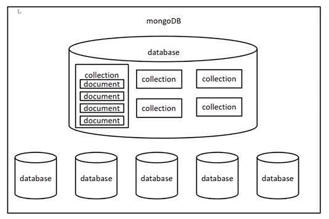

# Node JS

> 1. **Node.js 中不能使用 BOM 和 DOM 的 API,可以使用** `console`和定时器 API
> 2. **Node.js 中的顶级对象为** `global,`也可以用 `globalThis`访问顶级对象

## Buffer（缓冲器）

### 概念

**Buffer 是一个类似于 Array 的对象，用于表示固定长度的字节序列**

**Buffer 本质是一段固定长度的内存空间，用于处理二进制数据**

### 特点

1. **Buffer 大小固定且无法调整**
2. **Buffer 性能较好，可以直接对计算机内存进行操作**
3. **每个元素的大小为 1 字节（byte）**

### 使用

##### 创建 Buffer

```
let buf = Buffer.alloc(10);

let buf_2 = Buffer.allocUnsafe(10);

let buf_3 = Buffer.from('hello');
```

##### Buffer 与字符串的转换

```
let buf_4 = Buffer.from([105, 108, 111, 118, 101, 121, 111, 117]);

console(buf_4.toString());

> iloveyou
```

##### Buffer 的读写

```
// []
let buf = Buffer.from('hello');

console.log(buf[0].toString(2)); //01101000
```

## fs

**file system**

### 文件写入

| **方法**                      | **说明**     |
| ----------------------------- | ------------ |
| **writeFile**                 | **异步写入** |
| **writeFileSync**             | **同步写入** |
| **appendFile/appendFileSync** | **追加写入** |
| **createWriteStream**         | **流式写入** |

#### writeFile

**语法：**`fs.writeFile(file, data[, options], callback)`

**参数说明：**

- **file 文件名**
- **data 待写入的数据**
- **options 选项设置**
- **callback 写入回调**

**返回值：**`undefined`

```
const fs = require("fs");

fs.writeFile("./1.txt", "hello world", (err) => {
  if (err) throw err;
  console.log("文件已被保存");
});
```

#### writeFileSync

**语法：**`fs.writeFileSync(file, data[, options])`

```
const fs = require("fs");

fs.writeFileSync("./1.txt", "hello world");
```

#### appendFile

**语法：**`fs.writeFile(file, data[, options], callback)`

```
const fs = require("fs");

fs.appendFile("./1.txt", "hello world", (err) => {
  if (err) throw err;
  console.log("文件已被保存");
});
```

#### appendFileSync

**语法：**`fs.appendFileSync(file, data[, options])`

```
const fs = require("fs");

fs.appendFileSync("./1.txt", "hello world");
```

> `fs.writeFile("./1.txt", "hello world",{flag:a}, (err) => {` > `if (err) throw err;` > `console.log("文件已被保存");` > `});`同样能实现追加功能

#### createWriteStream

**语法：**`fs.createWriteStream(file)`

```
const ws = fs.createWriteStream("./1.txt");

ws.write("hello world");

ws.close();
```

### 文件读取

| **方法**             | **说明**     |
| -------------------- | ------------ |
| **readFile**         | **异步读取** |
| **readFileSync**     | **同步读取** |
| **createReadStream** | **流式读取** |

#### readFile

**语法：**`fs.readFile(path[, options], callback)`

**参数说明：**

- **path 文件路径**
- **options 选项配置**
- **callback 回调函数**

**返回值：**`undefined`

```
const fs = require("fs");

fs.readFile("./1.txt", (err, data) => {
    if (err) throw err;
    console.log(data.toString());
    }
);
```

#### readFileSync

**语法：**`fs.readFile(path[, options])`

```
const data = fs.readFileSync("./1.txt");
```

#### createReadStream

**语法：**`fs.createReadStream(file)`

```
const rs = fs.createReadStream("./1.txt");

rs.on("data", (chunk) => {
    console.log(chunk.toString());
});

rs.on("end", () => {
    console.log("end");
});
```

### 文件复制

```
const fs = require('fs');

//方式一
let data = fs.readFileSync('./1.txt');

fs.writeFileSync('./2.txt', data);

//方式二
const rs = fs.createReadStream('./1.txt');
const ws = fs.createWriteStream('./3.txt');

rs.on('data', (chunk) => {
    ws.write(chunk);
});

// rs.pipe(ws)等价
```

### 文件移动与重命名

**在 Node.js 中，我们可以使用** `rename`或 `renameSync`来移动或重命名文件或文件夹

**语法：**

`fs.rename(oldPath, newPath, callback)`

`fs.renameSync(oldPath, newPath)`

**参数说明：**

- **oldPath 文件当前的路径**
- **newPath 文件新的路径**
- **callback 操作后的回调**

```
const fs = require("fs");

// 重命名
fs.rename("1.txt", "2.txt", (err) => {
  if (err) throw err;
  console.log("Rename complete!");
});

// 移动
fs.rename("1.txt", "../data/1.txt", (err) => {
  if (err) throw err;
  console.log("Rename complete!");
});
```

### 删除文件

**在 Node.js 中，我们可以使用** `unlink`或 `unlinkSync`来删除文件

**语法：**

`fs.unlink(path,callback)`

`fs.unlinkSync(path)`

**参数说明：**

- **path 文件路径**
- **callback 操作后的回调**

```
const fs = require("fs");

fs.unlink("./1.js", (err) => {
    if (err) {
        console.log(err);
    }
    console.log("删除成功");
})

//rm
fs.rm("./1.js", (err) => {
  if (err) {
    console.log(err);
  }
  console.log("删除成功");
});
```

### 文件夹操作

| **方法**                | **说明**       |
| ----------------------- | -------------- |
| **mkdir/mkdirSync**     | **创建文件夹** |
| **readdir/readdirSync** | **读取文件夹** |
| **rmdir/rmdirSync**     | **删除文件夹** |

#### 创建文件夹

**在 Node.js 中，我们可以使用** `mkdir`或 `mkdirSync`来创建文件夹

**语法：**

`fs.mkdir(path[,options], callback)`

`fs.mkdirSync(path[,options])`

**参数说明：**

- **path 文件夹路径**
- **options 选项配置（可选）**
- **callback 操作后的回调**

```
const fs = require("fs");

fs.mkdir("./test", (err) => {
  if (err) {
    console.log(err);
  } else {
    console.log("folder created");
  }
});

// 递归创建
fs.mkdir("./a/b/c", {recursive: true}, (err) => {
  if (err) {
    console.log(err);
  } else {
    console.log("folder created");
  }
});
```

#### 读取文件夹

```
fs.readdir("test", (err, files) => {
  if (err) {
    console.log(err);
  } else {
    console.log(files);
  }
});
```

#### 删除文件夹

```
fs.rmdir("test", (err) => {
  if (err) {
    console.log(err);
  } else {
    console.log("folder deleted");
  }
});

// 递归删除
fs.rmdir("./a", {recursive: true}, (err) => {
  if (err) {
    console.log(err);
  } else {
    console.log("folder deleted");
  }
});
```

### 查看资源状态

**在 Node.js 中，我们可以使用** `stat`或 `statSync`来查看资源的详细信息

**语法：**

`fs.stat(path[,options],callback)`

`fs.statSync(path[,options])`

**参数说明：**

- **path 文件夹路径**
- **options 选项配置（可选）**
- **callback 操作后的回调**

```
fs.stat("1.js", (err, stats) => {
  if (err) {
    console.log(err);
  } else {
    console.log(stats);
  }
  //isFile
  console.log(data.isFile());
  //isDirectory
  console.log(data.isDirectory());  
});
```

### \_\_dirname

`__dirname`与 `require`类似，都是 Node.js 环境中的'全局'变量

`__dirname`保存着当前文件所在目录的绝对路径，可以使用\_\_**dirname 与文件名拼接成绝对路径**

```
let data fs.readFileSync(__dirname +/data.txt');
console.log(data);
```

> **使用 fs 模块的时候，尽量使用\_\_dirname 将路径转化为绝对路径，这样可以避免相对路径产生的 Bug**

## path

| **API**           | **说明**                     |
| ----------------- | ---------------------------- |
| **path.resolve**  | **拼接规范的绝对路径**       |
| **path.sep**      | **获取操作系统的路径分隔符** |
| **path.parse**    | **解析路径并返回对象**       |
| **path.basename** | **获取路径的基础名称**       |
| **path.dirname**  | **获取路径的目录名**         |
| **path.extname**  | **获取路径的扩展名**         |

```
const path = require('path')

path.resolve(__dirname, 'index.html');
```

## http

### 创建 http

```
const http = require("http");

// 创建服务对象
const server = http.createServer((req, res) => {
  res.end("Hello World");
});

// 监听端口，启动服务
server.listen(3000, () => {
  console.log("Server is running...");
});
```

> **注意事项：**
>
> 1. **命令行** `crtl+c`停止服务
> 2. **当服务启动后，更新代码 必须重启服务才能生效**
> 3. **响应内容中文乱码的解决办法**
>    ```
>    res.setHeader('content-type','text/html;charset=utf-8');
>    ```
> 4. **端口号被占用**
>    1. **关闭当前正在运行监听端口的服务**
>    2. **修改其他端口号**

### 获取 HTTP 请求报文

**想要获取请求的数据，需要通过** `request`对象

| **含义**           | **语法**                                                          |
| ------------------ | ----------------------------------------------------------------- |
| **请求方法**       | **request.method**                                                |
| **请求版本**       | **request.httpVersion**                                           |
| **请求路径**       | **request.url**                                                   |
| **URL 路径**       | **require('url').parse(request.url).pathname**                    |
| **URL 查询字符串** | **require('url').parse(request.url,true).query**                  |
| **请求头**         | **request.headers**                                               |
| **请求体**         | **request.on('data',(chunk) => {})** **request.on('end',()=>{})** |

**注意事项：**

1. `request.url`只能获取路径以及查询字符串，无法获取 URL 中的域名以及协议的内容
2. `request.headers`将请求信息转化成一个对象，并将属性名都转化成了『小写』
3. **关于路径：如果访问网站的时候，只填写了 P 地址或者是域名信息，此时请求的路径为「**`/`』
4. **关于 favicon.ico：这个请求是属于浏览器自动发送的请求**

```
const http = require("http");

const server = http.createServer((req, res) => {
  let body = '';
  req.on('data', chunk => {
    body += chunk;
  });
  req.on('end', () => {
    console.log(body);
  });
  res.end("Hello World");
});

server.listen(3000, () => {
  console.log("Server is running...");
});
```

> **获取路径和查询字符串新方法**
>
> ```
> const http = require("http");
>
> const server = http.createServer((req, res) => {
> let url = new URL(req.url, 'http://127.0.0.1:8080')
> console.log(url.pathname);
> console.log(url.searchParams.get('keyword'));
> res.end("Hello World");
> });
>
> server.listen(3000, () => {
> console.log("Server is running...");
> });
> ```

### 设置 HTTP 响应报文

| **作用**             | **语法**                                         |
| -------------------- | ------------------------------------------------ |
| **设置响应状态码**   | **response.statusCode**                          |
| **设置响应状态描述** | **response.statusMessage**                       |
| **设置响应头信息**   | **response.setHeader('头名','头值)**             |
| **设置响应体**       | **response.write('xx')** **response.end('xxx')** |

## 模块化

### 暴露数据

**模块暴露数据的方式有两种：**

1. `module.exports = value;`
2. `exports.name = value;`

> **使用时有几点注意**
>
> - `modules.exports`可以暴露任意数据
> - **不能使用** `exports = value`的形式暴露数据，模块内部 module 与 exports 的隐式关系 `exports = module.exports = {}`

### 导入模块

**在模块中使用 require 传入文件路径即可引入文件**

```
const test = require('./me.js')
```

**注意事项：**

1. **对于自己创建的模块，导入时路径建议写相对路径，且不能省略** `./`和 `../`
2. `js`和 `json`文件导入时可以不用写后缀，`c/c++`编写的 `node`扩展文件也可以不写后缀，但是一般用不到
3. **如果导入其他类型的文件，会以** `js`文件进行处埋工
4. **如果导入的路径是个文件夹，则会首先检测该文件夹下** `package.json`文件中 `main`属性对应的文件，
   **如果** `main`属性不存在，或者 `package.json`不存在，则会检测文件夹下的 `index.js`和 `index.json`,
   **如果还是没找到，就会报错**
5. **导入** `node.js`内置模块时，直接 `require`模块的名字即可，无需加 `./`和 `../`

> `module.exports`、`exports`以及 `require`这些都是 CommonJS 模块化规范中的内容而 Node.js 实现了 CommonJS 模块化规范

## 包管理工具

### npm

**npm 全称 Node Package Manager，是 node.js 官方内置的包管理工具**

#### 初始化

**创建一个空目录，然后依次目录为工作目录启动命令行工具，执行** `npm init`

`npm init`命令的作用是将文件夹初始化为一个包，交互式创建 `package.json`

`package.json`是包的配置文件，每个包都必须要有 `package.json`

```
{
"name": "1", #包的名字
    "version": "1.0.0", #包的版本
    "description": "", #包的描述
    "main": "index.js", #包的入口文件
    "scripts": { #脚本配置
"test":
},
"author": "", #作者
"license": "ISC" #开源证书
}
```

> **注意事项：**
>
> 1. **包名不能使用中文、大写，默认值是文件夹的名称，所以文件夹名称也不能使用中文和大写**
> 2. **版本号要求 x.x.x 的形式定义，x 必须是数字，默认值是 1.0.0**
> 3. **ISC 证书与 MIT 证书功能上是相同的**
> 4. `package.json`可以手动创建与修改
> 5. **使用** `npm init -y`或者 `npm init --yes`极速创建 `package.json`

#### 搜索包

**搜索包的方式有两种**

1. **命令行** `npm s/search 关键字`
2. **网站搜索**[https://www.npmjs.com/](https://www.npmjs.com/)

#### 下载安装包

**我们可以通过** `npm install`和 `npm i` 命令安装包

```
npm install <包名>
npm i <包名>
```

**运行之后文件夹下会增加两个资源**

- `node_modules`存放下载的包
- `package-lock.json`用来锁定包的版本

#### 生产依赖与开发依赖

| **类型**     | **命令**                      | **补充**                                                                               |
| ------------ | ----------------------------- | -------------------------------------------------------------------------------------- |
| **生产依赖** | `npm i -S npm i --save`       | **-S 等效于--save，-S 是默认选项** **包信息保存在 package.json 中** `dependencies`属性 |
| **开发依赖** | `npm i -D` `npm i --save-dev` | **-D 等效于--save-dev** **包信息保存在 package.json 中** `devDependencies`属性         |

> **开发依赖是只在开发阶段使用的依赖包，而生产依赖是开发阶段和最终上线运行阶段都用到的依赖包**

#### 全局安装

**我们可以执行安装选项-g 进行全局安装**

```
npm i -g nodemon
```

**全局安装后就可以在命令行的任何位置运行** `nodemon`命令

**该命令的作用是自动重启 node 应用程序**

> **说明：**
>
> - **全局安装的命令不受工作目录位置影响**
> - **可以通过** `npm root -g`可以查看全局安装包的位置
> - **不是所有包都适合全局安装，只有全局类工具才适合，可以通过查看包的官方文档来确定安装方式**

#### 安装包依赖

**在项目协作中有一个常用的命令就是** `npm i` ，通过该命令可以依据 `package.json`和 `package-lock.json`的依赖声明安装项目依赖

```
npm i
npm install
```

#### 安装指定版本的包

```
npm i <包名@版本号>
```

#### 删除依赖

```
## 局部删除
npm remove
npm r
## 全局删除
npm remove -g
```

#### 配置命令别名

**通过配置** `package.json`中的 `scripts`属性可以更简单的执行命令

```
{
"scripts":{
"server": "node server.js",
        "start": "node index.js"
    }
}
```

**配置完成之后，可以使用别名执行命令**

```
npm run server
npm run start
```

`start`别名比较特别，使用时可以省略 `run`

```
npm start
```

> **说明：**
>
> - `npm start`是项目中常用的一个命令，一般用来启动项目
> - `npm run`有自动向上级目录查找的特性，跟 `require`函数也一样
> - **对于陌生的项目，我们可以通过查看** `scripts`属性来参考项目的一些操作

### cnpm

#### 介绍

**cnpm 是一个淘宝构建的 npmjs.com 的完整镜像，网址**[https://npmmirror.com/](https://npmmirror.com/)

**cnpm 服务部署在国内阿里云服务器上，可以提高包的下载速度**

**官方也提供了一个全局工具包 cnpm,操作命令与 npm 大体相同**

#### 安装

```
npm install -g cnpm --registry=https://registry.npmmirror.com
```

#### npm 配置淘宝镜像

##### 直接配置

```
npm config set registry https://registry.npmmirror.com/
```

##### 工具配置

**使用** `nrm`配置 npm 的镜像地址 `npm registry manager`

1. **安装 nrm**
   ```
   npm i -g nrm
   ```
2. **修改镜像**
   ```
   nrm use taobao
   ```
3. **检查是否配置成功**
   ```
   npm config list
   ```

### yarn

#### 介绍

**yarn 是由 Facebook 在 2016 年推出的新的 javascript 包管理工具，网址：**[https://yarnpkg.com/](https://yarnpkg.com/)

#### 安装

```
npm i -g yarn
```

#### 命令

| **功能**         | **命令**                                                       |
| ---------------- | -------------------------------------------------------------- |
| **初始化**       | **yarn init/yarn init -y**                                     |
| **安装包**       | **yarn add** **yarn add <> --dev** **yarn global add nodemon** |
| **删除包**       | **yarn remove** **yarn global remove**                         |
| **安装项目依赖** | **yarn**                                                       |
| **运行命令别名** | **yarn <别名> #不需要添加** `run`                              |

#### 配置淘宝镜像

```
yarn config set registry https://registry.npmmirror.com/
```

**可以通过** `yarn config list`查看 yarn 的配置项

### 管理发布包

#### 创建与发布

**我们可以将自己开发的工具包发布到 npm 服务上，方便自己和其他开发者使用，操作步骤如下：**

1. **创建文件夹，并创建文件** `index.js`,在文件中声明函数，使用 `module.exports`暴露
2. **npm 初始化工具包，**`package.json`填写包的信息（包的名字是唯一的）
3. **注册账号**[https://www.npmjs.com/signup](https://www.npmjs.com/signup)
4. **激活账号（一定要激活账号）**
5. **修改为官方的官方镜像（命令行中运行** `nrm use npm`)
6. **命令行下** `npm login`填写相关用户信息
7. **命令行下** `npm publish`提交包**👌**

#### 更新包

**后续可以对自己发布的包进行更新，操作步骤如下**

1. **更新包中的代码**
2. **测试代码是否可用**
3. **修改** `package.json`中的版本号
4. **发布更新**
   ```
   npm publish
   ```

#### 删除包

```
npm unpublish
```

### nvm

**nvm 全称** `Node Version Manager`，用来管理 node 版本的工具，方便切换不同版本的 Node.js

##### 命令

| **命令**                  | **说明**                            |
| ------------------------- | ----------------------------------- |
| **nvm list available**    | **显示所有可以下载的 Node.js 版本** |
| **nvm list**              | **显示已安装的版本**                |
| **nvm install 18.12.1**   | **安装 18.12.1 版本的 Node.js**     |
| **nvm install latest**    | **安装最新版的 Node.js**            |
| **nvm uninstall 18.12.1** | **删除某个版本的 Node.js**          |
| **nvm use 18.12.1**       | **切换 18.12.1 的 Node.js**         |

## ExpressJS

### express 介绍

**express 是一个基于 Node.js 平台的极简、灵活的 WEB 应用开发框架，官方网址：**[https://www.expressjs.com.cn/]()

**简单来说，express 就是一个封装好的工具包，封装了很多功能，便于我们开发 WEB 应用（HTTP 服务）**

### express 路由

#### 什么是路由

**官方定义：路由确定了应用程序如何响应客户端对特定端点的请求**

#### 路由的使用

**一个路由的组成有请求方法，路径和回调函数组成**

**express 中提供了一系列方法，可以很方便的使用路由，使用格式如下：**

```
app.<method>(path,callback)
```

```
const express = require("express");

// 创建应用对象
const app = express();

// 创建路由
app.get("/", (req, res) => {
  res.send("Hello World!");
});

app.get("/test", (req, res) => {
  res.send("test");
});

app.all("*", (req, res) => {
  res.send("404");
});

// 监听端口号
app.listen(8000, () => {
  console.log("服务器启动成功~");
});
```

#### 获取请求参数

**express 框架封装了一些 API 来方便获取请求报文中的数据，并且兼容原生 HTTP 模块的获取方式**

```
const express = require("express");

// 创建应用对象
const app = express();

// 创建路由
app.get("/", (req, res) => {
  //兼容的
  console.log(req.method);
  console.log(req.url);
  console.log(req.httpVersion);
  console.log(req.headers);

  //独有的
  console.log(req.query);
  console.log(req.params);
  console.log(req.get("Host"));

  res.send("Hello World!");
});

// 监听端口号
app.listen(8000, () => {
  console.log("服务器启动成功~");
});
```

#### 获取路由参数

**路由参数指的是 URL 路径中的参数**

```
app.get("/:id", (req, res) => {
  res.send(req.params.id);
});
```

#### 响应设置

```
const express = require("express");

// 创建应用对象
const app = express();

// 创建路由
app.get("/", (req, res) => {
  //原生响应
  res.statusCode = 200;
  res.statusMessage = "OK";
  res.setHeader("Content-Type", "text/html;charset=utf-8");
  res.write("<h1>你好</h1>");
  res.end("Hello World!");

  // express响应
  res.status(200);
  res.set("Content-Type", "text/html;charset=utf-8");
  res.send("<h1>你好</h1>");
  
  //其他响应
  res.redirect("http://www.baidu.com");
  res.download("./public/1.txt");
  res.sendFile(__dirname + "/public/1.txt");
  res.json({ name: "zs", age: 18 });
});

// 监听端口号
app.listen(8000, () => {
  console.log("服务器启动成功~");
});
```

### express 中间件

#### 什么是中间件

**中间件本质是一个回调函数**

**中间件函数可以向路由回调一样访问请求对象，响应对象**

#### 中间件的作用

**中间件的作用就是使用函数封装公共操作，简化代码**

#### 中间件的类型

- **全局中间件**
- **路由中间件**

##### 全局中间件

**每一个请求到达服务端之后都会执行全局中间件函数**

```
// 声明中间件函数
let recordMiddleware = function(req,res,next){
//实现功能代码
    //......
    //执行next函数（当如果希望执行完中间件函数之后，仍然继续执行路由中的回调函数，必须调用next）
    next();
}
// 使用中间件函数
app.use(recordMiddleware);
```

##### 路由中间件

```
app.get("/admin", recordMiddleware, (req, res) =>{
res.send('');
});
```

#### 静态资源中间件

```
app.use(express.static(__dirname + '/public'));
```

> **注意事项：**
>
> 1. **index.html 文件为默认打开的资源**
> 2. **如果静态资源与路由规则同时匹配，谁先匹配谁就响应**
> 3. **路由响应动态资源，静态资源中间件响应静态资源**

#### 获取请求体数据

**express 可以使用** `body-parser`包处理请求体

**安装**

```
npm i body-parser
```

**导入包**

```
const bodyParser = require('body-parser');
```

**获取中间件函数**

```
// 处理querystring格式的请求体
let urlParser = bodyParser.urlencoded({extended:false});
// 处理JSON格式的请求体
let jsonParser = bodyParser.json();
```

**设置路由中间件，然后使用** `request.body`来获取请求体数据

```
app.post('/login', urlParser, (req,res)=>{
//请求体数据
    request.body;
    console.log(request.body.username);
    console.log(request.body.userpass)l
    res.send();
})
```

#### 防盗链

```
app.use((req, res, next) => {
let referer = req.get('referer');
    if(referer){
let url = new URL(referer);
        let hostname = url.hostname;
    }
    if(hostname !== '127.0.0.1'){
res.send('404');
    }
    next();
})
```

#### 路由模块化

```
// adminRouter.js
const express = require('express');

const router = express.Router();

router.get('/admin',(req, res) => {
   res.send('');
});

// index.js
const adminRouter = require('./routes/adminRouter');

app.use(adminRouter);
```

#### express-generator

**通过应用生成器工具 express-generator 可以快速创建一个应用的骨架**

## MongoDB

### 介绍

**MongoDB 是一个基于分布式文件存储的数据库，**[https://www.mongodb.com/](https://www.mongodb.com/)

### 核心概念

- **数据库(database) 数据库是一个数据仓库，数据库服务下可以创建很多数据库，数据库中可以存放很多集合**
- **集合(collection) 集合类以于 J5 中的数组，在集合中可以存放很多文档**
- **文档(document) 文档是数据库中的最小单位，类似于 JS 中的对象**



**可以通过 JSON 文件来理解 Mongodb 中的概念**

- **一个 JSON 文件好比是一个数据库，一个 Mongodb 服务下可以有 N 个数据库**
- **JSON 文件中的一级属性的数组值好比是集合**
- **数组中的对象好比是文档**
- **对象中的属性有时也称之为字段**

> **一般情况下**
>
> - **一个项目使用一个数据库**
> - **一个集合会存储同一种类型的数据**

### 命令行交互

#### 数据库命令

**显示所有的数据库**

```
show dbs
```

**切换到指定的数据库，如果数据库不存在会自动创建数据库**

```
use 数据库名
```

**显示当前所在的数据库**

```
db
```

**删除当前数据库**

```
use 库名
db.dropDarabase()
```

#### 集合命令

**创建集合**

```
db.createCollection('集合名称')
```

**显示当前数据库中的所有集合**

```
show collections
```

**删除某个集合**

```
db.集合名.drop()
```

**重命名集合**

```
db.集合名.renameCollection('newName')
```

#### 文档命令

**插入文档**

```
db.集合名.insert(文档对象);
```

**查询文档**

```
db.集合名.find(查询条件)
```

`_id是mongodb自动生成的唯一编号，用来唯一标识文档`

**更新文档**

```
db.集合名.update(查询条件，新的文档)
db.集合名.update({name:'张三'},{$set:{age:19}})
```

**删除文档**

```
db.集合名.remove(查询条件)
```

### Mongoose

#### 介绍

**Mongoose 是一个对象文档模型库**

#### 作用

**方便使用代码操作 mongodb 数据库**

#### 使用流程

```
const mongoose = require("mongoose");

mongoose.connect("mongodb://localhost:27017/test");

mongoose.connection.once("open", () => {
  console.log("数据库连接成功");
  // 创建结构对象
  let Schema = new mongoose.Schema({
    name: String,
    age: Number,
  });
  // 创建模型对象
  let Model = mongoose.model("student", Schema);

  Model.create({
    name: "张三",
    age: 18,
  });
});

mongoose.connection.on("error", (err) => {
  console.log("数据库连接失败", err);
});

mongoose.connection.on("close", () => {
  console.log("数据库连接断开");
});
```

#### 字段类型

| **类型**       | **描述**                                                   |
| -------------- | ---------------------------------------------------------- |
| **String**     | **字符串**                                                 |
| **Number**     | **数字**                                                   |
| **Boolean**    | **布尔值**                                                 |
| **Array**      | **数组，也可以使用** `[]`来标识                            |
| **Date**       | **日期**                                                   |
| **Buffer**     | **Buffer 对象**                                            |
| **Mixed**      | **任意类型，需要使用** `mongoose.Schema.Types.Mixed`指定   |
| **Objectld**   | **对象 ID，需要使用** `mongoose.Schema.Types.ObjectId`指定 |
| **Decimal128** | **高精度数字，需要使用** `mongoose.Schema.Decimal128`指定  |

#### 字段值验证

**Mongoose 有一些内建验证器，可以对字段值进行验证**

##### 必填项

```
title: {
type: String,
    require: true
}
```

##### 默认值

```
title: {
type: String,
    default: '匿名'
}
```

##### 枚举值

```
gender: {
type: String,
    enum: ['男','女']
}
```

##### 唯一值

```
title: {
type: String,
    uniqe: true
}
```

#### 删除文档

```
Model.deleteOne({
    name: "张三",
  })
    .then((data) => {
    console.log(data);
})
    .catch((err) => {
    console.log(err);
});

Model.deleteMany({
    name: "张三",
}).then((data) => {
    console.log(data);
});
```

#### 更新文档

```
Model.updateOne({ name: "张三" }, { age: 20 }).then((data) => {
    console.log(data);
});

Model.updateMany({ name: "张四" }, { age: 20 }).then((data) => {
    console.log(data);
});
```

#### 读取文档

```
Model.findOne({ name: "张三" }).then((data) => {
    console.log(data);
  });

Model.find({ name: "张四" }).then((data) => {
    console.log(data);
});
```

#### 条件控制

##### 运算符

**在 mongodb 不能用> < >= <= !==等运算符，需要使用替代符号**

- `>`使用 `$gt`
- `<`使用 `$lt`
- `>=`使用 `$gte`
- `<=`使用 `$lte`
- `!==`使用 `$ne`

```
db.students.find({id:{$gt:3}})
```

##### 逻辑运算

`$or`逻辑或的情况

```
db.students.find({$or:[{age:18},{age:24}]});
```

`$and`逻辑与的情况

```
db.students.find({$and: [{age:{$lt:20}},{age:{$gt:15}}]});
```

##### 正则匹配

**条件中可以直接使用 JS 的正则语法，通过正则可以进行模糊查询**

```
db.students.find({name: new RegExp('三')});
```

##### 个性化读取

###### 字段筛选

```
//0: 不要的字段
//1: 要的字段
Model.find()
    .select({ name: 1, _id: 0 })
    .then((docs) => {
      console.log(docs);
    });
```

###### 数据排序

```
//sort 排序
//1:升序
//-1:倒序
 Model.find()
    .sort({ age: -1 })
    .then((docs) => {
      console.log(docs);
    });
```

###### 数据截取

```
//skip 跳过 limit 限定
 Model.find()
    .skip(2)
    .limit(2)
    .then((docs) => {
      console.log(docs);
    });
```

## 接口

### 简介

**接口是前后端通信的桥梁**

**简单理解：一个接口就是服务中的一个路由规则，根据请求响应结果**

### RESTful API

**RESful API 是一种特殊风格的接口，主要特点有如下几个：**

- **URL 中的路径表示资源，路径中不能有动词，例如** `create`,`delete`,`update`等这些都不能有
- **操作资源要与 HTTP 请求方法对应**
- **操作结果要与 HTTP 响应状态码对应**

### json-sever

**json-sever 本身是一个 JS 编写的工具包，可以快速搭建 RESTful API 服务**

**官方地址：**[https://github.com/typicode/json-server](https://github.com/typicode/json-server)

**操作步骤：**

1. **全局安装**
   ```
   npm i -g json-server
   ```
2. **创建 JSON 文件（db.json），编写基本结构**
   ```
   {
       "song":[
           {"id":1, "name":"1"},
           {"id":2, "name":"2"},
           {"id":3, "name":"3"}
       ]
   }
   ```
3. **以 JSON 文件所在文件夹为工作目录，执行如下命令**
   ```
   json-server --watch db.json
   ```

**默认监听端口为 3000**
